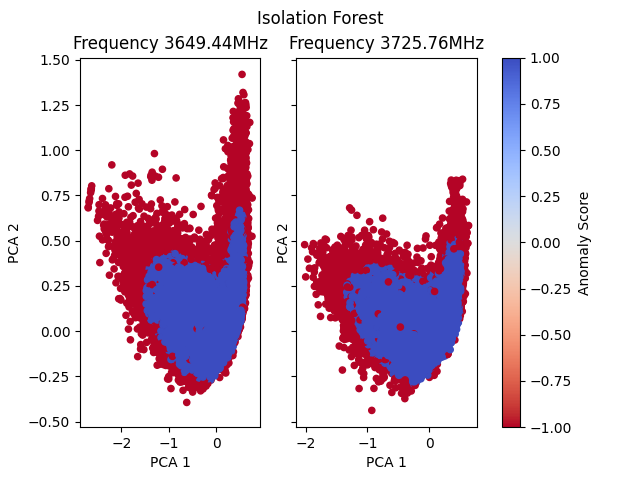

# Prerequisites

## Libraries

To run these scripts you need to install the following libraries:
    
1. numpy (v1.x)
2. scikit-learn
3. matplotlib
4. pandas

You can install them like this:

```
pip install "numpy<2"
pip install scikit-learn
pip install matplotlib
pip install pandas
```

## Data

The experiemnt evalues the **5G - Passive Measurements.csv** (2.2GB) dataset available [here](https://zenodo.org/records/8224890). This file should be placed into the `./data/` directory and renamed to `RawData.csv`.
It is possible to change the required filename in [**isolate_campaign.py**](https://github.com/Hugo1234f/5G-DiGIT/blob/main/t3/isolate_campain.py)

# Running the experiment

The experiment is run in this order:

1. isolate_campaign.py
2. scale_cont.py
3. train.py
4. plot.py | anomaly_desc.py

## isolate_campaign.py

This file scrubs the raw data file from several labels. This is mainly to reduce the dimension of the model space. Some labels are removed since they don't really affect performance, such as Date and Lat/Long. Others are removed since they have a high corelation (>=0.8) to other metrics.

This file also isolates the *OW*, or outside-walking campaigns. The result of this gets saved to `./data/scrubbed_campaigns.csv`

## scale_cont.py

This file preprocesses the data in two ways. First it maps the two different frequencies found in the data to 0 (3649.44MHz) and 1 (3725.76MHz). It then scales the each metric using the scikit StandardScalar.

The file creates two files, the scaled data `./data/scaled.csv` and a subset `./data/training_data.csv` containing a 10% subset of of the data to allow a reduced training time.

## train.py

This file trains an IsolationForest model. It divides the data in two based on its frequency mapping and independently fits a model to the data. It also Creates two PCA values that brings the now 15 dimensional data down into 2 dimensions. For each frequency it creates two files, one normal file that is used in `plot.py` and one *long* file used in `anomaly_desc.py`. These are placed in `./data/results/`

## plot.py

This file uses pyplot to display a scatter plot of the two models. Here red dots represent abnormalities and blue dots normal data.



## anomaly_desc.py

This file compares the abnormalities against the normal data. For each feature it calculates a mean of the abnormalities and compares it to the mean of the normal data. It then displays how much each metric contributed to the data being labled as abnormal. This analysis shows that about 0.35% of our data has been classified as abnormalities, and that the biggest contributor to that is the SS_PBCH-RSRP with 10.6% compared to an average of 6.7%